# Manuál pre vytváranie produktových kariet

## 1. Ciele manuálu

Hlavným cieľom manuálu je zabrániť vytváraniu zbytočných duplicít v systéme a vytvoriť jednotný systém vo vytváraní kariet produktov a ich názvov, tak aby vytvorené číslo a názov karty produktu bolo viditeľné a ľahko dohľadateľné pre všetkých. Tak aby sme správne založenou kartou so správnymi údajmi a správne nastavenými parametrami boli konkurencieschopní v „internetovom boji“ o zákazníka.

## 2. Nastavenie správnych údajov v produktovej karte

### 2.1 Založenie novej karty:
K vytvoreniu novej karty použite túto cestu:

**NEXTIS / Sklad & produkty PIM / Produkty a sklad / Karty produktů (skupiny) / Nová karta skupiny produktů**
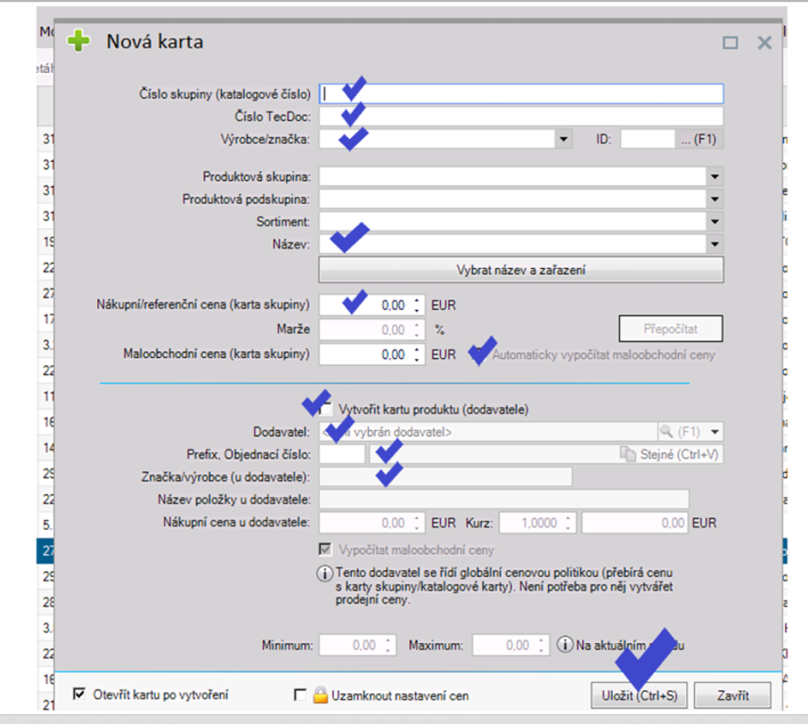

### 2.2 Číslo skupiny / číslo TecDoc

#### 2.2.1 Základné pravidlá:
- Kód položky je **vždy bez medzier** (bez medzier pred kódom, v kóde a za kódom).
-	Ak je v kóde kombinácia čísla a textu, **text je vždy veľkými písmenami.**
-	Ak je TecDoc-ový výrobca dielu – **číslo skupiny je rovnaké** ako **je kód pre TecDoc.**

#### 2.2.2 Ukážky nesprávne zadaných kódov:

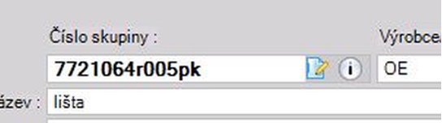
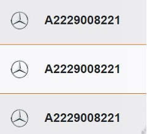
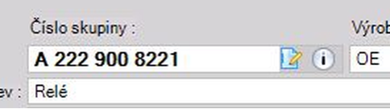
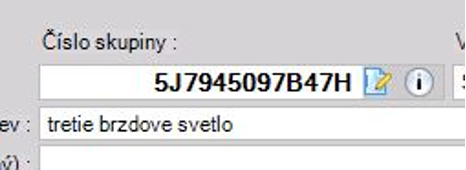
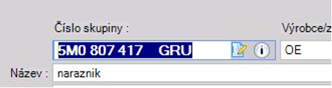
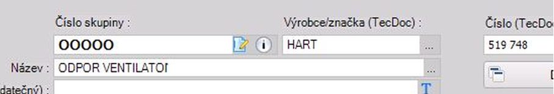

#### 2.2.3 Zakladanie olejových kariet:

Pri zakladaní produktových kariet olejov platia pri tvorbe kódu tieto pravidlá:
-	Olej **WOLF, RAVENOL, FEBI, VAG** – číslovanie, tak ako je uvedené v TecDocu.
-	Ostatné oleje – **ELF, SELENIA, MOTUL, MOBIL, TOTAL, BMW, SHELL, CASTROL....** – kód vždy začína skratkou značky oleja a nasleduje číselný alebo kód, ak výrobca číselný kód nemá je potrebné vytvoriť kartu s označením viskozity a litráže. 

**Šablóny pre vytváranie kódov kariet olejov:**

**ELF5W30EVOFTFE1** – Motorový olej ELF 5W30 1L EVOLUTION FULLTECH **FESEL0W30WRFOR1** – Motorový olej FORD 0W30 1L WR FORWARD
**MOT104074** – Motorový olej MOTUL 10W50 1L 5100 4T
**MOB154294** -  Motorový olej MOBIL 5W30 5L ESP FORMULA
**TOT213768** – Motorový olej TOTAL 5W30 1L Quartz INEO ECS
**CAS15665F** – Motorový olej CASTROL 5W30 1L EDGE TITANIUM LL
**SHE999** – Motorový olej SHELL 5W30 1L Helix HX8 ECT
**BMW5W30LL041** – Motorový olej BMW 5W30 1L TPT LL04
**MAZ5W30ULTRA1** – Motorový olej MAZDA 5W30 1L ORIGINAL ULTRA
**27975** - Olej do automatickej prevodovky FEBI 1 L 
**GS55545M4** – Motorový olej VAG 0W30 5L LONGLIFE III FE 
**1221104-001-01-999** – Prevodový olej RAVENOL 75W 1L MTF-3

#### 2.2.4 Zakladanie kariet autopríslušenstva, kozmetiky a chémie:

- Sortiment, ktorý je predávaný pod skupinou produktov **AMTRA** – kód a výrobcu uvedenieme tak ako je na obale produktu –  nezadávame výrobcu AMTRA, ale uvedenie konkrétneho výrobcu MOJE AUTO, Permatex, STP, WD-40, Slime....
- Produkty od dodávateľa **AUTOMAX** - pred 4-miestny kód je potrebné zadať písmeno „A“ - **príklad A-0505** (4-miestne kódy sú v NEXTISE ťažko dohľadateľné).
- Karty **AMIO** – 5-ciferný kód z katalógu AMIO – výrobca uvedieme tak ako je uvedený v katalógu AMIO – ak je AMIO zadáme AMIO,  ak je BASEUS dávame BASEUS, Kufieta, Car commerce....  a podobne.
- **CAR COMMERCE** – ten istý tovar je dostupný vo firme Auto Partner pod CC+5-ciferný kód u dodávateľa AMIO pod 5-ciferným kód bez CC. Karty je potrebné založiť bez CC, tak ako je uvedené na produkte.

### 2.3 Výrobca / značka

#### 2.3.1 Základné pravidlá:

-	Pri vytváraní karty na **originálny diel** uveďte výrobcu **vždy OE** – nie ORIG DIEL, nie ORIGINÁLNE DIELY, nie ORI, konkrétnu značku (diel môže byť použiteľný pre viacero značiek príklad AUDI, SEAT, ŠKODA, VW, PSA, ....).
-	Do výrobcu **nezadávajte názov firmy**, od ktorej diel kupujete (LKQ, LUSJA, PANACEA, BARDI,MATEX...). Výnimka je pri dodávateľoch, ktorý sú aj výrobcami, napr. AMIO.
-	Ak je výrobca dielu TecDoc-ový – výrobcu **vyberiete zo zoznamu výrobcov** a zadáte ho tak ako je uvedený výrobca v TecDocu.
-	Ak výrobca dielu **nie je TecDoc-ový** – ako výrobcu uvediete výrobcu, ktorý je uvedený **na produkte** alebo tak **ako ho má uvedený dodávateľ** (BOLL, HART, NEO TOOLS, MOJE AUTO...)
-	Ak výrobcu dielu **nepoznáte** – do kolonky výrobca uvediete **“OST“**.
-	U turbodúchadiel od firmy MATEX **– do výrobcu uvediete „RC“**.

#### 2.2.2 Ukážky nesprávne zadaných výrobcov:

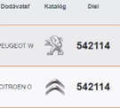
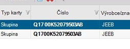
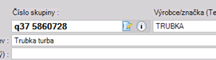
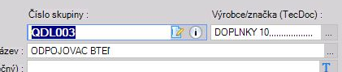
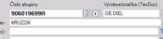
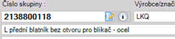
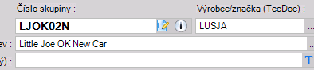

### 2.4 Názov produktu

#### 2.4.1 Základné pravidlá:

-	Názov má obsahovať **vždy podstatné meno produktu**, z názvu musí byť jasné o aký diel a produkt sa jedná. (Príklad Pneumatika 235/45 R18, Žiarovka P21W 24V, Motorový olej 5W30 5L....).
-	Názov začína **veľkým písmenom**, pokračuje malými písmenami. 
-	**V názvoch používajte diakritiku.**
-	Názov uvádzajte v **slovenskom jazyku**.
-	**Nepoužívajte skratky**. (nie brzd platn...).
-	**Nepoužívajte slangové a nárečové názvy** (nie dosky, desky, silenblok, šrób, kasňa, vičko ...)
-	**Maximálna dĺžka názvu je 50 znakov** – názvy neskracujeme, ak je pre identifikáciu tovaru potrebné uviesť dlhší názov, uvedieme ho celý aj napriek prekročeniu počtu znakov. 
