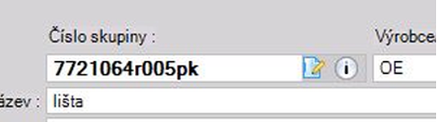
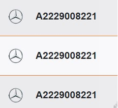
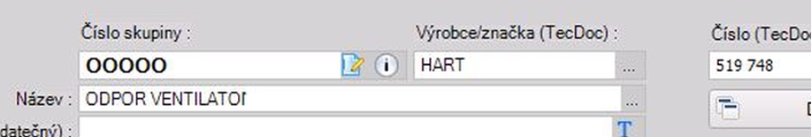
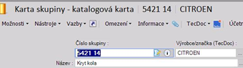
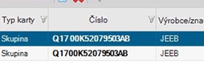
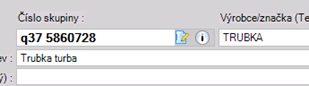
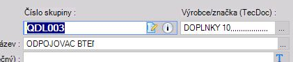
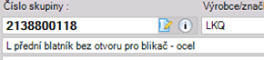

# Manuál pre vytváranie produktových kariet

## 1. Ciele manuálu

Hlavným cieľom manuálu je zabrániť vytváraniu zbytočných duplicít v systéme a vytvoriť jednotný systém vo vytváraní kariet produktov a ich názvov, tak aby vytvorené číslo a názov karty produktu bolo viditeľné a ľahko dohľadateľné pre všetkých. Tak aby sme správne založenou kartou so správnymi údajmi a správne nastavenými parametrami boli konkurencieschopní v „internetovom boji“ o zákazníka.

## 2. Nastavenie správnych údajov v produktovej karte

### 2.1 Založenie novej karty:
K vytvoreniu novej karty použite túto cestu:

**NEXTIS / Sklad & produkty PIM / Produkty a sklad / Karty produktů (skupiny) / Nová karta skupiny produktů**


### 2.2 Číslo skupiny / číslo TecDoc

#### 2.2.1 Základné pravidlá:
- Kód položky je **vždy bez medzier** (bez medzier pred kódom, v kóde a za kódom).
-	Ak je v kóde kombinácia čísla a textu, **text je vždy veľkými písmenami.**
-	Ak je TecDoc-ový výrobca dielu – **číslo skupiny je rovnaké** ako **je kód pre TecDoc.**

#### 2.2.2 Ukážky nesprávne zadaných kódov:








#### 2.2.3 Zakladanie olejových kariet:

Pri zakladaní produktových kariet olejov platia pri tvorbe kódu tieto pravidlá:
-	Olej **WOLF, RAVENOL, FEBI, VAG** – číslovanie, tak ako je uvedené v TecDocu.
-	Ostatné oleje – **ELF, SELENIA, MOTUL, MOBIL, TOTAL, BMW, SHELL, CASTROL....** – kód vždy začína skratkou značky oleja a nasleduje číselný alebo kód, ak výrobca číselný kód nemá je potrebné vytvoriť kartu s označením viskozity a litráže. 

**Šablóny pre vytváranie kódov kariet olejov:**

**ELF5W30EVOFTFE1** – Motorový olej ELF 5W30 1L EVOLUTION FULLTECH **FESEL0W30WRFOR1** – Motorový olej FORD 0W30 1L WR FORWARD
- **MOT104074** – Motorový olej MOTUL 10W50 1L 5100 4T
- **MOB154294** -  Motorový olej MOBIL 5W30 5L ESP FORMULA
- **TOT213768** – Motorový olej TOTAL 5W30 1L Quartz INEO ECS
- **CAS15665F** – Motorový olej CASTROL 5W30 1L EDGE TITANIUM LL
- **SHE999** – Motorový olej SHELL 5W30 1L Helix HX8 ECT
- **BMW5W30LL041** – Motorový olej BMW 5W30 1L TPT LL04
- **MAZ5W30ULTRA1** – Motorový olej MAZDA 5W30 1L ORIGINAL ULTRA
- **27975** - Olej do automatickej prevodovky FEBI 1 L 
- **GS55545M4** – Motorový olej VAG 0W30 5L LONGLIFE III FE 
- **1221104-001-01-999** – Prevodový olej RAVENOL 75W 1L MTF-3

#### 2.2.4 Zakladanie kariet autopríslušenstva, kozmetiky a chémie:

- Sortiment, ktorý je predávaný pod skupinou produktov **AMTRA** – kód a výrobcu uvedenieme tak ako je na obale produktu –  nezadávame výrobcu AMTRA, ale uvedenie konkrétneho výrobcu MOJE AUTO, Permatex, STP, WD-40, Slime....
- Produkty od dodávateľa **AUTOMAX** - pred 4-miestny kód je potrebné zadať písmeno „A“ - **príklad A-0505** (4-miestne kódy sú v NEXTISE ťažko dohľadateľné).
- Karty **AMIO** – 5-ciferný kód z katalógu AMIO – výrobca uvedieme tak ako je uvedený v katalógu AMIO – ak je AMIO zadáme AMIO,  ak je BASEUS dávame BASEUS, Kufieta, Car commerce....  a podobne.
- **CAR COMMERCE** – ten istý tovar je dostupný vo firme Auto Partner pod CC+5-ciferný kód u dodávateľa AMIO pod 5-ciferným kód bez CC. Karty je potrebné založiť bez CC, tak ako je uvedené na produkte.

### 2.3 Výrobca / značka

#### 2.3.1 Základné pravidlá:

-	Pri vytváraní karty na **originálny diel** uveďte výrobcu **vždy OE** – nie ORIG DIEL, nie ORIGINÁLNE DIELY, nie ORI, konkrétnu značku (diel môže byť použiteľný pre viacero značiek príklad AUDI, SEAT, ŠKODA, VW, PSA, ....).
-	Do výrobcu **nezadávajte názov firmy**, od ktorej diel kupujete (LKQ, LUSJA, PANACEA, BARDI,MATEX...). Výnimka je pri dodávateľoch, ktorý sú aj výrobcami, napr. AMIO.
-	Ak je výrobca dielu TecDoc-ový – výrobcu **vyberiete zo zoznamu výrobcov** a zadáte ho tak ako je uvedený výrobca v TecDocu.
-	Ak výrobca dielu **nie je TecDoc-ový** – ako výrobcu uvediete výrobcu, ktorý je uvedený **na produkte** alebo tak **ako ho má uvedený dodávateľ** (BOLL, HART, NEO TOOLS, MOJE AUTO...)
-	Ak výrobcu dielu **nepoznáte** – do kolonky výrobca uvediete **“OST“**.
-	U turbodúchadiel od firmy MATEX **– do výrobcu uvediete „RC“**.

#### 2.3.2 Ukážky nesprávne zadaných výrobcov:










### 2.4 Názov produktu

#### 2.4.1 Základné pravidlá:

-	Názov má obsahovať **vždy podstatné meno produktu**, z názvu musí byť jasné o aký diel a produkt sa jedná. (Príklad Pneumatika 235/45 R18, Žiarovka P21W 24V, Motorový olej 5W30 5L....).
-	Názov začína **veľkým písmenom**, pokračuje malými písmenami. 
-	**V názvoch používajte diakritiku.**
-	Názov uvádzajte v **slovenskom jazyku**.
-	**Nepoužívajte skratky**. (nie brzd platn...).
-	**Nepoužívajte slangové a nárečové názvy** (nie dosky, desky, silenblok, šrób, kasňa, vičko ...)
-	**Maximálna dĺžka názvu je 50 znakov** – názvy neskracujeme, ak je pre identifikáciu tovaru potrebné uviesť dlhší názov, uvedieme ho celý aj napriek prekročeniu počtu znakov. 

#### 2.4.2 Ukážky nesprávne zadaných výrobcov:


*„Tovar alebo službu, ktorú podnikateľ predáva, nie je možné označiť na pokladničnom doklade len číselným alebo alfanumerickým kódom. Tovar alebo služba musí byť označená **tak, aby bolo možné jednoznačne predávaný tovar alebo poskytovanú službu identifikovať a odlíšiť od iného tovaru**, resp. služby, pričom je potrebné používať aj diakritiku. Povolené je aj používanie skráteného názvu predávaného tovaru alebo poskytovanej služby, ale aj v tomto prípade pozor na to, aby názov podnikateľ skrátil tak, aby tovar alebo poskytnutá služba bola jasne identifikovateľná.“*

:::danger[UPOZORNENIE]
<Highlight> Doklad s takýmito názvami nesmie odísť k zákazníkovi!</Highlight>

:::

#### 2.4.2 Príklady správnych názvov:

export const Highlight = ({ children }) => (
  <span
    style={{
      color: '#D42B49',
      fontWeight: 900,
    }}
  >
    {children}
  </span>
);


- <Highlight>Batérie:</Highlight> 

    - **Autobatéria EXIDE 77Ah 12V 760A Premium** (Názov, značka, kapacita, napätie, štartovací prúd, produktová rada)

- <Highlight> Oleje: </Highlight> 

    - **Motorový olej CASTROL 0W30 1L EDGE** (Názov, značka, viskozita, litráž, označenie produktovej rady)

- <Highlight> Kvapaliny: </Highlight>

    - **Nemrznúca zmes do ostrekovačov 5L -20C ovocná vôňa** (Názov, litráž, bližšie označenie)
    - **Brzdová kvapalina BOSCH DOT4 5L** (Názov tovaru, výrobca, typ, litráž)

- <Highlight> Autokozmetika/Chémia: </Highlight>

    - **Čistič bŕzd TEXTAR 500 ml sprej** (Názov, výrobca, veľkosť balenia, konzistencia, príp. iné doplňujúce údaje)
    - **Tekutý vosk K2 700ml SPECTRUM**

- <Highlight> Žiarovky: </Highlight>

    - **Žiarovka BOSCH H7 12V 55W Pure Light** (Názov, výrobca, typ svetla, napätie, výkon, označenie rady)

- <Highlight> Autodiely – príklady názvov: </Highlight>

    - **Brzdový kotúč, Brzdové platničky, Brzdový strmeň, ....Tlmič pruženia, Olejový filter, Palivový filter, Kabínový filter, Vzduchový filter, Pružina podvozku, Čelné sklo....**

Vždy do názvu uvedieme čo najviac informácií, ktoré sú potrebné: **napríklad nielen kryt, ale kryt čoho?** Nielen sada, ale sada čoho? Nielen lanko, ale lanko čoho? Aké lanko? ....

### 2.5 Zaradenie kariet do štruktúry katalógu

Pri zadávaní názvu je pre vybranú skupinu užívateľov povolené zaradenie karty do štruktúry kariet, t.z., že po zadaní názvu je potrebné doplniť ešte chýbajúce údaje o skupine, podskupine a sortimente.

**Prvým príkladom je, že skupinu zadávame rovnako ako je názov výrobcu**, t.z. v tomto prípade K2, podskupinu K2 a sortiment K2. Toto je prípad kedy v rolovacom okne nemáme na výber inú možnosť, pretože neexistuje u výrobcu K2 podrobnejšie členenie. Doplnenie by teda u tohto produktu bolo K2/ K2 / K2.


**Druhým príkladom je skupina originálnych dielov** u ktorých zadávame skupinu OE, do podskupiny uvedieme názov značky/ výrobcu a sortiment je rovnaký ako podskupina. V tomto prípade by bola cesta k produktu OE / VAG / VAG. Je to z dôvodu spoločných dielov pre celý koncert, rovnako u PSA. V prípade, že by sme založili kartu s výrobcom napríklad ŠKODA, neskôr niekto iný s výrobcom AUDI atď, došlo by k duplicite kariet na jeden originálny diel. 


**Tretím príkladom je skupina tecdocových dielov**, napríklad výrobca TRW. Skupina bude v tomto prípade TRW, podskupinu vyberieme z rolovacieho menu a zaradíme produkt správne. V prípade, že je produkt správne zaradený v podskupine je možné s ním neskôr lepšie pracovať pri nastavení cien (možnosť vybrať pre akciu podskupinu a urobiť nastavenie cien napríklad pre brzdy TRW), rovnako je to pomôckou pri vyhodnocovaní predajnosti a pri nákupoch.


<Highlight> Štvrtým prípadom sú karty, ktoré nemajú výrobcu tecdocového ani nie sú OE a ani pre nich v strome nie je potrebné vytvárať skupinu nakoľko môžu byť jednorázovým prekupom, pri takýchto kartách zadávame do výrobcu OST a zaradenie bude OSTATNE / OSTATNE / OSTATNE. </Highlight>

**Samostatnou skupinou sú produkty, kde je naviazaná na produkt záloha** za starý diel. V takomto prípade musíme okrem bežnej predajnej karty vytvoriť aj tovarovú kartu pre zálohu a zaradíme ju do skupiny Zálohy / podskupina podľa výrobcu. (Príklad Zálohy/TRW/TRW). V tovarovej karte potom naviažeme na kartu zálohu. V produktovej karte – príplatky cez možnosť „pridať zboží“ zadáme kód zálohy, jej množstvo a cenu. Takto bude položka správne naviazaná pri predaji k tovaru. 


### 2.6 Dodávateľ a objednávacie číslo / Výrobca u dodávateľa

Nie vždy je objednávacie číslo u dodávateľa rovnaké ako naše číslo – pred založením karty je potrebné preveriť či karta neexistuje v systéme pod iným kódom ako je objednávacie číslo u dodávateľa. 

#### 2.6.1 Príklady:

- <Highlight> AUTOPARTS </Highlight> – v NEXTISE kód 23587.200.1, výrobca ZIMMERMANN, v AUTOAPARTS kód AP15060D.
- <Highlight> AUTO PARTNER </Highlight> – v NEXTISE kód 42932, výrobca CAR COMMERCE, kód AUTO PARTNER CCM42932.
- <Highlight> MOTOROL </Highlight> – v NEXTISE 01-400, výrobca WD-40, kód MOTOROL AMT01-400.
- <Highlight> MOTO PROFIL </Highlight> – tento dodávateľ používa u položiek „PREFIX“ – tento údaje je potrebné pri zakladaní karty uviesť do kolónky prefiks. 


*U niektorých dodávateľov je možnosť objednávať kartónové balenia, takéto karty nezakladajte, pretože si vyžadujú špecifické nastavenia. V prípade potreby založenia takejto karty je na konci manuálu uvedený kontakt. *

*Ak je chybne zadaný objednávací kód alebo výrobca – nebudú sa správne zobrazovať stavy a aktualizovať sa správne ceny.*

:::danger[POZOR]
<Highlight> Nesprávne založená karta mala za následok vznik duplicity v NEXTISE </Highlight>
:::


### 2.7 Nastavenie náhrad v produktovej karte

U niektorých dielov hlavne tých netecdocových nie sú v karte naviazané náhrady. V tomto prípade si náhrady nahrávame sami. Náhrady v systéme sú dôležité či už pri naskladňovaní, vyhodnocovaní predajnosti, pri predaji, ale uľahčujú tiež vyhľadávanie zákazníkom. Majú svoj význam hlavne pri autochémii, autokozmetike, doplnkovom sortimente, náplniach, kvapalinách..., ale napríklad aj pri položkách, ktoré nie sú tecdocovým výrobcom, ale vieme ich na tecdocového naviazať.


Náhradu pridáme cez náhrady v produktovej karte, nová položka, zadáme kód náhrady a potvrdíme.

### 2.8 Nastavenie Eshop / SEO v produktovej karte

Ak chceme, aby položka zaradená v univerzálnych dieloch, je potrebné ju zaradiť do stromu univerzálnych dielov v produktovej karte – Eshop. Ak chceme, aby sa položka zobrazovala na eshope AutoSave – zvolíme stredisko Malacky, ak sa má zobrazovať na eshope Aukaro – volíme stredisko Aukaro. Vždy ju zaraďujeme do najnižšej možnej podkategórie. 

Položku môžeme zaradiť aj do viacerých kategórií / podkategórií – napríklad olej zadávame do členenia podľa viskozity aj podľa litráže. 

Ak nie je vytvorená kategória, do ktorej by mohla položka patriť pridáme novú cez funkciu „nová zložka“. Na ktorej kategórii sme – na takej úrovni novú zložku vytvorí. Po vytvorení takejto kategórie je potrebné urobiť ďalšie nastavenia – viac v bode 2.8.


<Highlight> Popis položky pre eshop: </Highlight> Je krátky popis, ktorý sa zobrazuje na eshope hneď za názvom a kódom. Tento popis môžeme uviesť rovnaký ako popis stránky.


Popis stránky / SEO popis  – nájdeme v „Zařazení a SEO. SEO popis, známy aj ako meta popis, je krátky text, ktorý sa zobrazuje pod názvom stránky vo výsledkoch vyhľadávania. Jeho úlohou je opísať obsah stránky a presvedčiť používateľov, aby na ňu klikli. 


<Highlight> SEO popis by mal byť: </Highlight>
    - pútavý a výstižne opisovať obsah stránky,
    - mal by obsahovať čo najviac kľúčových slov,
    - jeho dĺžka má byť 120-160 znakov,

:::tip Výsledok
Dobre napísaný popis môže pomôcť zlepšiť viditeľnosť našej stránky vo vyhľadávaní a prilákať viac návštevníkov.
:::

**HTML popis:** Je popis produktu bez obmedzenia počtu znakov. Tento popis obsahuje konkrétne informácie k produktu, vyzdvihuje jeho výhody, zhrnie jeho vlastnosti, obsahuje rôzne parametre produktu, môže v ňom byť uvedený návod na použitie, môže odkazovať na manuál k produktu...

Formát textu meníme. Názov „kľúčové vlastnosti“ alebo „výhody pre zákazníkov“ alebo „návod na použitie“ zadávame ako nadpis H2 zmenou formátu. Ostatný text nastavujeme ako formát normálny. V prípade, že potrebujeme použiť odrážky text, ktorý má mať odrážky označíme a volíme voľbu odrážky v hornom menu. Ak potrebujeme použiť nadpis nižšej kategórie pod nadpisom dva – volíme nadpis H3. Nadpis H1 nepoužívame – je to názov produktu z produktovej karty.


### 2.9 Prehľad univerzálnych dielov

Cesta k prehľadu univerzálnych dielov je cez produktové karty skupiny  - možnosti / prehľady / prehľad univerzálnych dielov.


Po otvorení je potrebné zvoliť stredisko AutoSave – Malacky , Aukaro – Aukaro. Okrem pridávania a ostraňovania nových kategórií / podkategórií v strome v prehľade robíme úpravy, ktoré sú doležité pre zobrazovanie a SEO.

Postavením sa na konkrétnu kategóriu, ktorú chceme upraviť vyberieme cez pravé tlačidlo možnosť „detailné nastavenie“. V detailnom nastavení zadávame:

    - <Highlight> Názov položky - </Highlight> je to názov, pod ktorým bude kategória v eshope zobrazovaná.
        - 
    - <Highlight> Meta titulek  - </Highlight> je názov, ktorý je zobrazovaný vo vyhľadávači nad meta / SEO popisom. 
        - 
    - <Highlight> Meta popis  - </Highlight> pre meta popis kategórie platia tie isté pravidlá ako pre meta popis konkrétneho produktu v produktovej karte. Je to popis, ktorý sa zobrazuje vo vyhľadávači pod meta názvom.
        - 
    - <Highlight> Popis  - </Highlight> Tento popis sa zobrazuje na eshope v hornej časti nad výberom produktov pri každej kategórií / podkategórii. Obsahovo popisuje čo sa v danej kategórií nachádza a okrem základnej charakteristiky kategórie môže obsahovať odkazy na kategórie / podkategórie v našom eshope.
        - 

<Highlight> Odkazy zadávame pomocou html príkazov: </Highlight>

```html title="Príklad"
<a href="link" class="description-link">Nazov</a>
```

Do vyššie uvedeného príkazu namiesto <Highlight> link </Highlight> kopírujeme link na stránke, na ktorý budeme odkazovať. Ak odkazujeme na interný link na stránke odkaz kopírujeme bez <Highlight> www.autosave.sk </Highlight> / <Highlight> www.aukaro.sk </Highlight>.

Ak to má byť napríklad na čističe okien link bude skopírovaný:

``` 
/sk/katalog/univerzalne-diely/cistenie/36043~36113~36145~36146/?root=-1&path=36043~36113~36145~36146
```


Namiesto <Highlight> Nazov </Highlight> – napíšeme do úvodzoviek názov odkazu v tomto prípade by to bolo čističov okien
    - <Highlight> Index poradia </Highlight>– zobrazenia – Určuje poradie v akom budú kategórie / podkategórie zobrazované. Ak index nezadáme budú radené abecedne alebo podľa čísla. Pozor napríklad pri podkategóriách, ktoré máme rozdelené podľa litráže, ak máme balenia: 1L, 3L, 5L, 10L, 20L..... Ak neurčíme indexáciu..bude ich radiť 1L, 10L, 20L, 3L....a pod. 


### 2.10 Zakladanie netovarovej skupiny kariet

Ak výsledkom nákupu a predaja nie je produkt, kartu zakladáme ako „ostatné karty – nezbožové“.

Do tejto skupiny zahŕňame napríklad: <Highlight> servis, oprava,  dopravné, poštovné, balné, bonus, nabíjanie, požičovné, storno poplatok,  ....</Highlight> 


## 3. Dôsledok nesprávneho vytvorenia karty 


## 4. Záver

### Názvy a kódy existujúcich kariet nikdy nemeňte!

### Pred vytváraním každej karty sa uistite, či už karta v systéme neexistuje! 

:::tip[Tip]

Napríklad pomocou vyhľadávania cez Fulltext, F7

:::

<Highlight> V prípade akýchkoľvek pripomienok a otázok k vytváraniu karty kontaktujte: </Highlight>

Mária Bartošová, e-mail: [maria.bartosova@autosave.sk](mailto:maria.bartosova@autosave.sk), tel.: [0905 303 531](tel:0905303531)